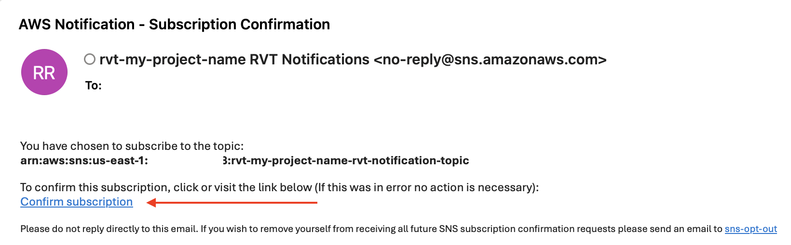
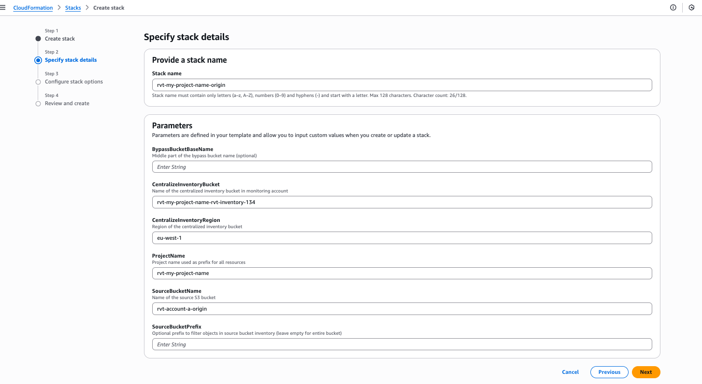

# Replication Validation Tool for S3 (RVT-S3)

## Table of Contents

- [Overview](#overview)
- [Opportunities for mismatches](#opportunities-for-mismatches)
- [Deployment Architecture](#deployment-architecture)
- [Sample Validation Report](#sample-validation-report)
- [Deployment Guide](#deployment-guide)
- [Tool Workflow](#tool-workflow)
- [Object Filtering](#object-filtering)
- [Accessing Daily Reports](#accessing-daily-reports)
- [CloudWatch Metrics](#cloudwatch-metrics)
- [RVT-S3 Reporting Behaviour](#rvt-s3-reporting-behaviour)
- [Remediating Mismatches](#remediating-mismatches)
- [Charges](#charges)
- [Cleaning Up](#cleaning-up)

## Overview

The Replication Validation Tool for S3 (RVT-S3) enables users to continuously verify that two [Amazon S3](https://aws.amazon.com/s3/) buckets (or prefixes) are fully synchronized, ensuring data integrity between source and destination buckets. This solution provides a way to confirm that the data on the source is identical to the data on the destination by identifying any missing objects in either location. Daily statistics are [output](#cloudwatch-metrics) to [Amazon CloudWatch](https://aws.amazon.com/cloudwatch/), and daily [reports](#sample-validation-report) are delivered via email or Slack.

In traditional storage systems with replication features, destination storage is typically read-only. However, [Amazon Simple Storage Service (Amazon S3) Replication](https://aws.amazon.com/s3/features/replication/) is an elastic, fully managed, low-cost feature that offers more flexibility. While Amazon S3 Replication rules verify that new objects in scope are replicated to one or more destination Amazon S3 buckets, permissions on these destination buckets control access in the usual manner. This means it's possible to delete, overwrite, or create new objects in the destination if permissions allow. Additionally, permanent deletions (`DeleteObjectVersion` requests) in the source bucket are not propagated, nor are some delete markers. These characteristics can lead to inconsistencies between source and destination buckets, creating unique challenges for maintaining data integrity and compliance.

RVT-S3 addresses these challenges by comparing object properties across bucket pairs, and generating detailed reports on any differences. By validating that the current versions of objects in both locations are identical, RVT-S3 gives you confidence that your replica bucket is a true and complete copy of your source data, and helps verify your replication strategy meets both operational and compliance requirements. **It does this at a very low [cost](#charges) of approximately $0.06 per month per million objects in scope plus $0.06 for CloudWatch metrics.**

**Object Comparison Logic**: RVT-S3 determines object synchronization by comparing both ETag and Last Modified Time between source and destination buckets. Objects are considered synchronized when they have matching object keys, identical ETags, and identical last modified timestamps. Objects with `PENDING` replication status are automatically excluded from reports until replication completes.

This is complimentary to [S3 Replication metrics](https://docs.aws.amazon.com/AmazonS3/latest/userguide/repl-metrics.html), which provide detailed, real-time monitoring of replication status including bytes and objects pending, and replication latency. RVT-S3 is not intended for real-time monitoring, as it relies on daily [S3 Inventory reports](https://docs.aws.amazon.com/AmazonS3/latest/userguide/storage-inventory.html).

**Remediation is out of scope**. For more details, see [Remediating Mismatches](#remediating-mismatches).

## Opportunities for mismatches

- **Object deletions**: Permanent deletions in source buckets are not propagated.
- **Lifecycle-induced delete darkers**: When [S3 Lifecycle rules expire objects](https://docs.aws.amazon.com/AmazonS3/latest/userguide/lifecycle-expire-general-considerations.html) in a versioned bucket, the resulting delete markers are not replicated.
- **Manually created delete markers**:  If [delete marker replication](https://docs.aws.amazon.com/AmazonS3/latest/userguide/delete-marker-replication.html) is enabled, manually-created delete markers (from soft delete requests) are replicated, provided the the replication rule is not filtered using object tags.
- **Disabled replication rules**: If a replication rule has been temporarily disabled, objects written to the source in that period will not have been replicated.
- **Changes in destination**: Objects can be deleted, overwritten, or created in destination buckets. [Two-way replication](https://docs.aws.amazon.com/AmazonS3/latest/userguide/replication.html#two-way-replication-scenario) is available if these changes are intended to be replicated to the source. 


## Deployment Architecture

RVT-S3 enables three primary topologies with its modular design. Separating deployments for source, destination and monitoring allows replication within or across accounts and regions. Monitoring can be within the same account and region as the source or destination, or completely separated.

#### Possible architectures:

   **Cross-account, cross-region:**
   - Origin (source) bucket in Account A, Region A
   - Destination bucket in Account B, Region B
   - Monitoring in Account C, Region C

   **Single-account, same-region:**
   - Origin bucket in Account A, Region A
   - Destination bucket in Account A, Region A
   - Monitoring in Account A, Region A

   **Any other combination, for example:**
   - Origin bucket in Account A, Region A
   - Destination bucket in Account A, Region B
   - Monitoring in Account B, Region C

The [Deployment Guide](#deployment-guide) focuses on a cross-account, cross-region architecture. For any other topology, simply deploy the templates in the desired account and region.


## Sample Validation Report

A validation report such as this one will be delivered daily, by either email or Slack, depending on the parameters chosen [during deployment](#deployment-steps).

If there are 10 or fewer objects to report:

```
RVT tool report for 2025-01-15

Total number of current objects in source-bucket-name: 139
Total number of current objects in destination-bucket-name: 140

Objects only in source-bucket-name: 3
Objects only in destination-bucket-name: 1
Objects with different version in each location: 2

Detailed list:
1. only in source: documents/file1.pdf (Bucket: source-bucket-name, Version: abc123)
2. only in source: images/photo2.jpg (Bucket: source-bucket-name, Version: def456)
3. only in source: data/report.csv (Bucket: source-bucket-name, Version: ghi789)
4. only in destination: temp/backup.zip (Bucket: destination-bucket-name, Version: jkl012)
5. different latest version: config/settings.json (Bucket: source-bucket-name, Version: xyz789)
6. different latest version: config/settings.json (Bucket: destination-bucket-name, Version: abc456)
```

If there are more than 10 objects to report, the detailed list is omited as follows:

```
RVT tool report for 2025-01-15

Total number of current objects in source-bucket-name: 139
Total number of current objects in destination-bucket-name: 140

Objects only in source-bucket-name: 15
Objects only in destination-bucket-name: 8
Objects with different version in each location: 12

See detailed list at: s3://centralized-bucket/athena_queries/2025-01-15-01-00/daily_report/
Direct console link: https://s3.console.aws.amazon.com/s3/buckets/centralized-bucket?prefix=athena_queries/2025-01-15-01-00/daily_report/
```
In either case, the detailed list (in CSV format) is available for review. For details, see [Accessing Daily Reports](#accessing-daily-reports).

## Deployment Guide

RVT-S3 has a modular deployment model, as discussed above. To accommodate separation of source, destination and monitoring across accounts and regions, it consists of four deployment steps and three CloudFormation templates. Adjust the account and region for each step as appropriate for your infrastruture.

### Prerequisites
- Source Amazon S3 bucket
- Destination Amazon S3 bucket
- Replication rule from source to destination


### Architecture Overview

At the end of the step-by-step deployment guide, this will be the deployed architecture:


The 'bypass buckets' are where the daily S3 Inventory reports are written. As these must be in the same region as the bucket they inventory, this standarized design enables the architecture variety described above, while incuring only a minimal cost overhead where it is unnecessary. Objects in the bypass buckets are removed after 1 day using S3 Lifecycle.

### Deployment Steps

1. **Monitoring Infrastructure**: Deploy CloudFormation template (`monitoring.yaml`) in Account C (Region C)
2. **Source Infrastructure**: Deploy CloudFormation template (`origin.yaml`) in Account A (Region A) 
3. **Destination Infrastructure**: Deploy CloudFormation template (`destination.yaml`) in Account B (Region B)
4. **Final Configuration**: Configure the centralized inventory bucket policy in the monitoring account

> **Reminder**: Three separate accounts and regions are not required. The complete solution works in a single account and region or any other available alternative. You simply need to deploy the templates according to your desired topology. 

**Expand each of the following steps for details**

<details>
<summary><strong>Step 1 - Monitoring.yaml template deployment in Account C, Region C.</strong></summary>

### From account C

1. Access Account C where you want to deploy the solution. Navigate to [AWS CloudFormation](https://us-east-1.console.aws.amazon.com/cloudformation/home?region=us-east-1#/getting-started) service. Verify the region you're using matches the region where you want to deploy the solution (check the top-right corner). In this example we will be deploying the solution in eu-west-1 (Ireland). Click "Create Stack" 


2. In the Prerequisites section, select "Choose an existing template." Click "Upload a template file," then "Choose file" and upload the [monitoring.yaml](https://gitlab.aws.dev/daviddcs/RVT/-/blob/main/CFN-templates/monitoring.yaml?ref_type=heads) file located in the CFN-templates folder. 


3. Input the parameters in the "Specify stack details" section. You can find an example below. Enter a stack name, we recommend this name to be: <your-project-name>-<template-you-are-deploying> so that it is easier to maintain. Example: "rvt-my-project-name-monitoring"

**Parameters**:
- **BucketName** (Optional): Name for your centralized inventory bucket that will store inventory reports from both buckets. If empty, uses naming convention: `<your-project-name>-rvt-inventory-<your-account-id>`
- **DestinationBucketName**: Name of your destination bucket in Account B
- **NotificationEmail**: Email address for receiving validation reports. Either this field or SlackWebhookUrl must be provided (both can be configured)
- **RetentionDays**: Lifecycle retention period for the centralized bucket (1-365 days, default: 7)
- **SlackWebhookUrl**: Slack webhook URL for receiving notifications. Either this field or NotificationEmail must be provided (both can be configured)
- **SourceBucketName**: Name of your source bucket in Account A

> **NOTE:** Follow [this guide](Resources/Docs/slack.md) to learn how to create a Slack Webhook URL.


4. In the "Configure stack options" section, keep everything as default. Check the checkbox that states "I acknowledge that AWS CloudFormation might create AWS Identity and Access Management (IAM) resources with custom names" and click "Next."

5. Finally, review all settings and click "Submit."

6. After the stack has been deployed successfully, navigate to the Outputs section. Verify that **RVTSetupStatus** is marked as "Configured successfully." Copy the following values to your clipboard as they will be used as input parameters for the other 2 templates:
    - CentralizedInventoryBucket
    - CentralizedInventoryRegion
    - DestinationBucketName
    - ProjectName 
    - SourceBucketName


7. Finally, you will receive an email and/or a Slack message asking you to confirm your Amazon Simple Notification Service (SNS) subscription.



</details>

<details>
<summary><strong>Step 2 - Deploy origin.yaml template in Account A (Region A)</strong></summary>

### Deploy from Account A (Source Account)

1. **Access CloudFormation Console**
   - Log into Account A where the source bucket is located
   - Navigate to [AWS CloudFormation](https://us-east-1.console.aws.amazon.com/cloudformation/home?region=us-east-1#/getting-started) service
   - Verify the region matches where your source bucket is located (check top-right corner)
   - Click **"Create Stack"**

   

2. **Upload Template**
   - In the Prerequisites section, select **"Choose an existing template"**
   - Click **"Upload a template file"**, then **"Choose file"**
   - Upload the [origin.yaml](https://gitlab.aws.dev/daviddcs/RVT/-/blob/main/CFN-templates/origin.yaml?ref_type=heads) file from the CFN-templates folder

   

3. **Configure Stack Parameters**
   
   **Stack Name**: Use the format `<your-project-name>-<template-name>` for easier maintenance
   
   Example: `rvt-my-project-name-origin`

   **Parameters** (use values copied from Step 1 outputs):
   - **BypassBucketBaseName** (Optional): Name for your source bypass bucket where inventory reports are generated before replication to the centralized bucket. If empty, uses naming convention: `<your-project-name>-<your-account-id>-source-bypass`
   - **CentralizedInventoryBucket**: Paste value from Step 1 outputs
   - **CentralizedInventoryRegion**: Paste value from Step 1 outputs
   - **ProjectName**: Paste value from Step 1 outputs
   - **SourceBucketName**: Paste value from Step 1 outputs
   - **SourceBucketPrefix** (Optional): If you want to limit validation to a specific prefix, define it here (must end with `/` delimiter, e.g., `my-prefix/`). Use the same prefix when deploying destination.yaml

   

4. **Configure Stack Options**
   - Keep all settings as default
   - Check the checkbox: **"I acknowledge that AWS CloudFormation might create IAM resources with custom names"**
   - Click **"Next"**

5. **Review and Deploy**
   - Review all settings
   - Click **"Submit"**

6. **Verify Deployment and Copy Output**
   - After successful deployment, navigate to the **Outputs** section
   - Verify **InventorySetupStatus** shows "Completed successfully"
   - Verify **ReplicationSetupStatus** shows "Configured successfully"
   - Copy the **CentralizedInventoryBucketPolicy** value for use in Step 4

   

</details>

<details>
<summary><strong>Step 3 - Deploy destination.yaml template in Account B (Region B)</strong></summary>

### Deploy from Account B (Destination Account)

1. **Access CloudFormation Console**
   - Log into Account B where the destination bucket is located
   - Navigate to [AWS CloudFormation](https://us-east-1.console.aws.amazon.com/cloudformation/home?region=us-east-1#/getting-started) service
   - Verify the region matches where your destination bucket is located (check top-right corner)
   - Click **"Create Stack"**

2. **Upload Template**
   - In the Prerequisites section, select **"Choose an existing template"**
   - Click **"Upload a template file"**, then **"Choose file"**
   - Upload the [destination.yaml](https://gitlab.aws.dev/daviddcs/RVT/-/blob/main/CFN-templates/destination.yaml?ref_type=heads) file from the CFN-templates folder

   

3. **Configure Stack Parameters**
   
   **Stack Name**: Use the format `<your-project-name>-<template-name>` for easier maintenance
   
   Example: `rvt-my-project-name-destination`

   **Parameters** (use values copied from Step 1 outputs):
   - **BypassBucketBaseName** (Optional): Name for your destination bypass bucket where inventory reports are generated before replication to the centralized bucket. If empty, uses naming convention: `<your-project-name>-<your-account-id>-destination-bypass`
   - **CentralizedInventoryBucket**: Paste value from Step 1 outputs
   - **CentralizedInventoryRegion**: Paste value from Step 1 outputs
   - **ProjectName**: Paste value from Step 1 outputs
   - **DestinationBucketName**: Paste value from Step 1 outputs
   - **DestinationBucketPrefix** (Optional): If you want to limit validation to a specific prefix, define it here (must match the prefix used in origin.yaml deployment). The prefix must end with `/` delimiter, e.g., `my-prefix/`

   

4. **Configure Stack Options**
   - Keep all settings as default
   - Check the checkbox: **"I acknowledge that AWS CloudFormation might create IAM resources with custom names"**
   - Click **"Next"**

5. **Review and Deploy**
   - Review all settings
   - Click **"Submit"**

6. **Verify Deployment and Copy Output**
   - After successful deployment, navigate to the **Outputs** section
   - Verify **InventorySetupStatus** shows "Completed successfully"
   - Verify **ReplicationSetupStatus** shows "Configured successfully"
   - Copy the **CentralizedInventoryBucketPolicy** value for use in Step 4

   

</details>

<details>
<summary><strong>Step 4 - Configure centralized bucket policy in Account C</strong></summary>

### Final Configuration in Account C (Monitoring Account)

1. **Update Centralized Inventory Bucket Policy**
   
   The centralized inventory bucket needs permissions to receive inventory reports from both source and destination accounts.
   
   - Navigate to the centralized inventory bucket in Account C
   - Go to the **Permissions** tab
   - Click **"Edit bucket policy"**

   
   
2. **Add Replication Permissions**
   
   - Keep the existing policy that was deployed by the monitoring.yaml template
   - Add **BOTH** policy statements that you copied from the outputs of:
     - Step 2 (origin.yaml deployment)
     - Step 3 (destination.yaml deployment)
   
   > **Important**: Remember to add a comma (`,`) to separate the policy statements, otherwise you will receive a JSON syntax error

   

   - Click **"Save changes"**

### 🎉 Deployment Complete!

You have successfully deployed the Replication Validation Tool for S3(RVT-S3). 

**What happens next:**
- You'll receive your first validation report within 48 hours
- Daily reports will be delivered via your configured notification method (email/Slack)

</details>

### Resources Deployed

<details>
<summary><strong>Expand for full details of the resources deployed by this tool</strong></summary>

### Account C Resources (Monitoring Account)

#### Core Infrastructure
- **Amazon S3 Bucket**: Centralized inventory storage with lifecycle rules
- **AWS Step Functions State Machine**: Orchestrates the validation workflow
- **Amazon SNS Topic**: Sends validation notifications (email/Slack)
- **CloudWatch Metrics**: RVT performance and mismatch tracking

#### Lambda Functions
- **symlink-modifier**: Processes inventory symlink files for centralized bucket
- **rvt-setup**: Configures S3 notifications and creates Athena tables
- **rvt-check-ir2**: Monitors destination inventory availability with retry logic
- **metadata-cleaner**: Processes Athena query results and creates temporary tables
- **rvt-email-formatter**: Formats validation reports and sends CloudWatch metrics
- **cleanup**: Removes temporary resources and Glue tables after processing

### Account A Resources (Origin bucket Account)

#### Core Infrastructure
- **Bypass S3 Bucket**: Temporary storage for source bucket inventory reports
- **S3 Inventory Configuration**: Daily inventory generation for source bucket
- **S3 Replication Configuration**: Forwards inventory reports to centralized bucket

#### Lambda Functions
- **rvt-source-final-setup**: Configures source bucket inventory and replication

### Account B Resources (Destination bucket Account)

#### Core Infrastructure
- **Bypass S3 Bucket**: Temporary storage for destination bucket inventory reports
- **S3 Inventory Configuration**: Daily inventory generation for destination bucket
- **S3 Replication Configuration**: Forwards inventory reports to centralized bucket

#### Lambda Functions
- **rvt-destination-final-setup**: Configures destination bucket inventory and replication

</details>

## Tool Workflow

#### 1. Inventory Generation
- Amazon S3 generates daily S3 Inventory reports for source and destination buckets. Any existing inventory reports are not used or affected
- Reports are written to the bypass buckets in Parquet format with default S3-SSE encryption, then replicated to the centralized inventory bucket where they are also encrypted with default S3-SSE encryption

#### 2. Validation Trigger
- Amazon EventBridge detects new inventory objects
- Step Function workflow is automatically triggered when inventory report 1 is written to the centralized inventory report bucket

#### 3. Data Processing
- **IR2 Check**: Verifies destination inventory availability in centralised inventory report bucket (waits 10 minutes and retries if not present)
- **Initial Parallel Processing**: Simultaneously processes source and destination inventories
- **Athena Queries**: Identify objects present only in source or destination
- **Metadata Cleaning**: Athena queries generate multiple artifacts (metadata) in addition to the CSV document with the desired results. This process removes these artifacts that are not necessary for the workflow
- **Replication Status Filtering**: Splits source objects into PENDING (held) vs others (processed)
- **Destination Filtering**: Excludes held keys from destination results
- **Mismatch Combination**: Combines source and destination mismatches, identifies different versions
- **Filter Application**: Creates filter table and applies exclusions from `filter-list.csv`
- **Count Queries**: Parallel counting of different mismatch types

#### 4. Result Generation
- **Report Formatting**: Creates human-readable validation report with counts and details
- **Threshold Logic**: Shows detailed list (≤10 objects) or S3 locations (>10 objects)

#### 5. Notification and Metrics
- **Email Delivery**: Sends formatted report via SNS
- **CloudWatch Metrics**: Publishes validation metrics for monitoring and alerting
- **Amazon S3 Storage**: Detailed results stored for further analysis with default S3-SSE encryption
- **Cleanup**: Removes temporary tables and files

## Object Filtering
- **Filter File**: `s3://centralized-bucket/filter-list/filter-list.csv`
- **Purpose**: Exclude specific objects or prefixes from validation reports
- **Format**: CSV with columns: bucket_name, object_key, version_id
- **Wildcards**: Enables prefix matching for object keys

<details>
<summary><strong>Expand for details of how to configure the filter list</strong></summary>

### From Account C (Monitoring Account)
**Step 1: Locate the Filter File**
1. Access Account C where the centralized inventory bucket is located
2. Navigate to the centralized inventory bucket (check the bucket name in the CloudFormation outputs section)
3. Look for the `filter-list/` prefix containing a file named `filter-list.csv`
4. **File Location**: `s3://your-centralized-bucket/filter-list/filter-list.csv`

**Step 2: Download and Edit the File**
1. Download the `filter-list.csv` file using:
   - **AWS Console**: Navigate to the file and click "Download"
   - **AWS CLI**: `aws s3 cp s3://your-bucket/filter-list/filter-list.csv ./filter-list.csv`
   - **SDK**: Use your preferred AWS SDK

**Step 3: File Format and Fields**
The CSV file contains three columns:
```csv
bucket_name,object_key,version_id
```

**Field Descriptions:**
- **bucket_name**: Name of the bucket containing objects to filter (source or destination)
- **object_key**: Object key/path to exclude from reports
- **version_id**: Specific version ID to filter (optional, leave empty for all versions)

**Step 4: Configuration Options and Expected Behavior**

| Configuration | Example | Expected Behavior |
|---------------|---------|-------------------|
| **Specific Object** | `my-source-bucket,documents/temp.txt,` | Excludes exact object from reports |
| **Prefix Filtering** | `my-source-bucket,logs/,` | Excludes all objects starting with "logs/" |
| **Key Only** | `,documents/temp.txt,` | Excludes object with this key from all buckets |
| **Specific Version** | `my-dest-bucket,config.json,abc123xyz` | Excludes only that specific version |
| **Multiple Buckets** | `bucket-a,temp/,`<br>`bucket-b,cache/,` | Excludes prefixes from different buckets |
| **Wildcard All Versions** | `my-bucket,backup.zip,` | Excludes object regardless of version |

**Step 5: Example Filter File**
```csv
bucket_name,object_key,version_id
my-source-bucket,temp/,
my-source-bucket,logs/debug.log,
my-destination-bucket,cache/,
my-source-bucket,backup/old-data.zip,def456ghi
```

**Step 6: Upload Modified File**
1. Save your changes to the CSV file
2. Upload back to S3:
   - **AWS Console**: Use "Upload" button to replace the existing file
   - **AWS CLI**: `aws s3 cp ./filter-list.csv s3://your-bucket/filter-list/filter-list.csv`
   - **SDK**: Use your preferred AWS SDK

**Important Notes:**
- Changes take effect on the next daily validation run
- Empty `version_id` field applies filter to all versions of that object
- Use `/` suffix for prefix matching (e.g., `temp/` matches all objects starting with "temp/")
- Filter applies to both "only in source" and "only in destination" scenarios
- Filtered objects will not appear in email reports but validation still occurs

</details>


## Accessing Daily Reports

<details>
<summary><strong>Method 1: Download CSV Files </strong></summary>

- **Location**: `s3://centralized-bucket/athena_queries/YYYY-MM-DD-01-00/daily_report/xyz.csv`
- **Format**: CSV files with detailed mismatch information
- **Access**: Use AWS CLI, S3 Console, or SDK to download files

</details>

<details>
<summary><strong>Method 2: Query with Amazon Athena </strong></summary>

1. Create external table pointing to daily report location: 

**IMPORTANT:** In the Location section, you will have to input the prefix included in the details list section of the email received (format: s3://centralized-bucket/athena_queries/yyyy-mm-dd-01-00/daily_report/)

```sql
CREATE EXTERNAL TABLE daily_mismatches (
    location STRING,
    bucket STRING,
    key STRING,
    version_id STRING,
    e_tag STRING,
    last_modified_date STRING
)
ROW FORMAT SERDE 'org.apache.hadoop.hive.serde2.OpenCSVSerde'
WITH SERDEPROPERTIES (
    'separatorChar' = ',',
    'quoteChar' = '"',
    'escapeChar' = '\\'
)
LOCATION 's3://centralized-bucket/athena_queries/yyyy-mm-dd-01-00/daily_report/' -- include your daily location here
TBLPROPERTIES ('skip.header.line.count'='1');
```

2. Query the data:
```sql
SELECT *
FROM daily_mismatches;
```

</details>


## CloudWatch Metrics
The RVT tool automatically publishes metrics to Amazon CloudWatch for monitoring and alerting:

- **Namespace**: `RVT/{project-name}`
- **Metric Name**: `RVTMetrics`
- **Dimensions**: RVT-MetricType with the following values:
  - `Total number of current objects in {source-bucket}`
  - `Total number of current objects in {destination-bucket}`
  - `Objects only in {source-bucket}`
  - `Objects only in {destination-bucket}`
  - `Objects with different version in each location`

**Use Cases:**
- Create CloudWatch alarms for mismatch thresholds
- Build dashboards to track replica consistency over time
- Set up automated responses to validation failures


## RVT-S3 Reporting Behaviour

This tool has been designed to minimize false positives, and not report mismatches which could be transient due to replication latency. For the full logic of what is reported, expand the following section.

<details>
<summary><strong>Expand this section to show reporting behaviour detail.</strong></summary>

**Basic Functionality** 

| ID | Source |Destination| Description               | Expected  | Result |
|----|----|----|---------------------------|-----------|--------|
| 1 | A | A | Identical object exists in both source and destination buckets with matching key and ETAG | Match | No report |
| 2 | A | - | Object exists in source bucket but is missing from destination bucket (replication failure or deletion) | Mismatch | Report object in source only |
| 3 | - | A | Object exists in destination bucket but is missing from source bucket (manual creation or source deletion) | Mismatch | Report object in destination only |
| 4 | A | B | Object A exists only in source, Object B exists only in destination | Mismatch | Report A in source only, B in destination only |
| 5 | B | A | Object B exists only in source, Object A exists only in destination | Mismatch | Report B in source only, A in destination only |
| 6 | A | a | Same object key but different content (ETAG mismatch) indicating corruption or modification | Mismatch | Report A in source only, a in destination only |
| 7 | a | A | Same object key but different content (ETAG mismatch) indicating corruption or modification | Mismatch | Report a in source only, A in destination only |

**S3 Versioning behaviour** (note: Only current versions are monitored) 
| ID | Source  |Destination| Description               | Expected  | Result |
|----|----|----|---------------------------|-----------|--------|
| 8 | DM + A | DM + A | Delete marker is the current version in both buckets | Match | No report |
| 9 | - | DM + A | Delete marker exists in destination but is missing from source (both return 404 on retrieval) | Match | No report |
| 10 | DM + A | - | Delete marker exists in source but is missing from destination (both return 404 on retrieval) | Match | No report |
| 11 | DM + A | A | Delete marker in source and object A in destination | Mismatch | Report objects with different version in each location |
| 12 | A' + A | A' + A | Current version A' with non-current version A exists identically in both buckets | Match | No report |
| 13 | A' | A' + A | Current version A' in source, same current version plus additional non-current in destination | Match | No report (only current versions monitored) |
| 14 | A' + A | A' | Current version A' in both buckets, but source has additional non-current version | Match | No report (only current versions monitored) |
| 15 | A | A' + A | Different current versions - A in source vs A' in destination | Mismatch | Report objects with different version in each location |
| 16 | A' + A | A | Different current versions - A' in source vs A in destination | Mismatch | Report objects with different version in each location |

 **Replication Status-Based Filtering** `*`
| ID | Source |Destination| Description               | Expected  | Result |
|----|----|----|---------------------------|-----------|--------|
| 17 | A (PENDING) | - | Object with PENDING replication status exists only in source - replication in progress | Mismatch | No report (held for next day) |
| 18 | A (COMPLETED) | A (REPLICA) | Object successfully replicated with COMPLETED/REPLICA status | Match | No report |
| 19 | - | A (any status) | Object exists only in destination regardless of replication status | Mismatch | Report A only in destination |
| 20 | A' (PENDING) + A | A | New version A' with PENDING status in source, old version A in destination | Mismatch | No report (held for next day) |
| 21 | A (FAILED) | - | Object with FAILED replication status exists only in source | Mismatch | Report A only in source |
| 22 | A (NULL) | - | Object with no replication status (pre-replication rule) exists only in source | Mismatch | Report A only in source |

**Multiple Mismatches** 
| ID | Source |Destination| Description               | Expected  | Result |
|----|----|----|---------------------------|-----------|--------|
| 23 | A+B+C+D+E +F+G+H+I+J | - | 10 objects exist only in source bucket (mass replication failure) | Mismatch | Report detailed list (≤10 objects) |
| 24 | - | A+B+C+D+E +F+G+H+I+J | 10 objects exist only in destination bucket (manual additions) | Mismatch | Report detailed list (≤10 objects) |
| 25 | A+B+C+D+E | F+G+H+I+J | 5 different objects in source, 5 different objects in destination (total 10 mismatches) | Mismatch | Report detailed list (≤10 objects) |
| 26 | A+B+C+D+E | F+G+H+I+J+K | 11 total mismatched objects across both buckets | Mismatch | Report S3 locations (>10 objects) |
| 27 | A+B+C+D+E +F | G+H+I+J+K | 11 total mismatched objects across both buckets | Mismatch | Report S3 locations (>10 objects) |

**Object Filtering** 
| ID | Source |Destination| Filter List | Description               | Expected  | Result |
|----|----|----|-------------|---------------------------|-----------|--------|
| 28 | A | - | A | Object exists only in source but is in filter list | Mismatch | No report (filtered out) |
| 29 | - | A | A | Object exists only in destination but is in filter list | Mismatch | No report (filtered out) |
| 30 | prefix/A | - | prefix/ | Object with key matching filter prefix exists only in source | Mismatch | No report (filtered out) |
| 31 | A | B | - | Objects with different content, no filter applied | Mismatch | Report A in source only, B in destination only |
| 32 | A+B+C | D+E+F | A,D | Mixed scenario with some objects filtered | Mismatch | Report B+C in source only, E+F in destination only |

`*` The **Replication Status-Based Filtering** section (scenarios 17-22) addresses how the RVT tool handles replication latency using S3's built-in replication status tracking. Since [S3 replication is asynchronous](https://docs.aws.amazon.com/AmazonS3/latest/userguide/replication.html#replication-workload-requirements), the tool uses the `replication_status` field from [S3 Inventory reports](https://docs.aws.amazon.com/AmazonS3/latest/userguide/storage-inventory.html) to intelligently filter objects based on their replication state. This status-based approach provides more accurate replication monitoring than time-based thresholds, as it relies on S3's actual replication state rather than estimated timing.

**Additional Test Coverage:**

The **Object Filtering** section (scenarios 28-32) validates the filter functionality that allows users to exclude specific objects or prefixes from validation reports using the `filter-list.csv` file.

</details>

### Limitations

- **Reporting Constraints:** The daily validation report reflects the bucket state from the previous day. Objects with PENDING replication status are automatically excluded from reports, ensuring accurate reporting without false positives from objects in the process of being replicated. 
   - Note: Objects in PENDING status are included in [S3 Replication metrics](https://docs.aws.amazon.com/AmazonS3/latest/userguide/repl-metrics.html), which are the best way to monitor S3 Replication behaviour in real-time.

- **Read-Only Validation:** This tool provides validation insights for Amazon S3 replication scenarios without modifying or repairing data inconsistencies automatically. Remediation is out of scope.

- **Current Object Versions:** This tool focuses on validating the [current object version](https://docs.aws.amazon.com/AmazonS3/latest/userguide/versioning-workflows.html) and does not validate any number of non-current versions of an object. This is because [S3 lifecycle](https://docs.aws.amazon.com/AmazonS3/latest/userguide/object-lifecycle-mgmt.html) expiration of noncurrent versions may be configured differently on each bucket, and even if identically configured may not be enacted at the same time.


## Remediating Mismatches

The focus of this tool is revealing mismatches, not remediating them. 

As the tool matches both ETag and Last Modified Time, it will consider objects to be mismatches if they haven't been replicated by S3 Replication. If an object is missing from the destination, you can use S3 Batch Replication to replicate it from the source, provided it was not previously [deleted by specifying the version ID of the object from the destination bucket](https://docs.aws.amazon.com/AmazonS3/latest/userguide/s3-batch-replication-batch.html#batch-replication-considerations). In this case, we recommend making a copy of the object in the source bucket. The new object will replicate to the destination and be reflected as a match.

Objects in the destination bucket that are not present in the source bucket can be deleted from the destination, replicated to the source, or added to the [filter list](#object-filtering).


## Charges
This solution uses several AWS services, each with its own pricing model. However, for workloads with fewer than 1 million objects, key components like Lambda (1M free requests/month), Step Functions (4,000 free state transitions/month), and SNS (1,000 free notifications/month) fall within AWS Free Tier limits, resulting in minimal to no costs for smaller deployments. Scaling the example below results in a **total cost of approximately $0.06 per month per million objects in scope plus $0.06 for CloudWatch metrics.**

### Fully Costed Example

Example solution: Origin bucket (**1.5 Billion objects**) in eu-west-1 and Destination bucket (**1.3 Billion objects**) in us-east-2, with **187 Million** mismatches in source and **185 Million** mismatches in destination (intentionally high for cost-modelling purposes). Monitoring deployed in eu-west-1 region.

**Daily Cost Breakdown:**

| Service | Daily Cost |
|---------|------------|
| Athena | $1.20 | Queries, based on the amount of data scanned |
| S3 | $0.10 | PUTs and storage for S3 Inventory reports |
| Cross Region Data Transfer | $1.00 | Cross-region data transfer for inventory reports from destination bucket only
| Lambda | $0.00 | Cost for Lambda function invocations |
| AWS Step Functions | $0.00 | Cost for flow orchestration |
| EventBridge | $0.00 | Cost for events |
| SNS | $0.00 | Cost for notifications |
| Cloudwatch | $0.002 | Cost for custom metrics |
| **Total** | **$2.30** |

**Note:** Storage costs for S3 inventory reports *are* included in this cost breakdown. These costs are minimized through lifecycle expiry rules in the centralized inventory and bypass buckets, which do not have S3 Versioning enabled. The bypass buckets expire objects after 1 day, while the centralised inventory bucket expires objects after the period defined during deployment (default 7 days).

These costs (excluding CloudWatch) can be expected to scale approximately linearly with object count. Adjust the cross-region data transfer cost estimate depending on your architecture choice.


### Full list of AWS services Used

- [Amazon Simple Storage Service (S3)](https://aws.amazon.com/s3/)
- [AWS Lambda](https://aws.amazon.com/lambda/)
- [Amazon Athena](https://aws.amazon.com/athena/)
- [Amazon EventBridge](https://aws.amazon.com/eventbridge/)
- [AWS Step Functions](https://aws.amazon.com/step-functions/)
- [Amazon Simple Notification Service (SNS)](https://aws.amazon.com/sns/)
- [AWS Identity and Access Management (IAM)](https://aws.amazon.com/iam/)
- [Amazon CloudWatch](https://aws.amazon.com/cloudwatch/)

## Cleaning Up

To remove the RVT-S3 solution from your environment:

1. **Empty S3 buckets**: Empty the **centralized inventory** bucket (Account C) and both **bypass** buckets (Account A and B). You can find the bucket names in the CloudFormation stack outputs.

2. **Delete Athena workgroup**: From Account C (monitoring account), navigate to Athena, select "Workgroups" in the left pane, and delete the Athena workgroup. The workgroup name is `{project-name}-rvt-workgroup`.

3. **Delete CloudFormation stacks**: Delete the CloudFormation stacks in the following order:
   - Account A: `{project-name}-origin` stack
   - Account B: `{project-name}-destination` stack  
   - Account C: `{project-name}-monitoring` stack

4. **Remove S3 Inventory configurations**: Confirm S3 inventory configurations were removed from your source and destination buckets (these should be automatically removed when deleting the stacks). Remove manually if required.

---

