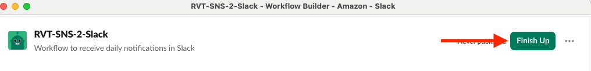
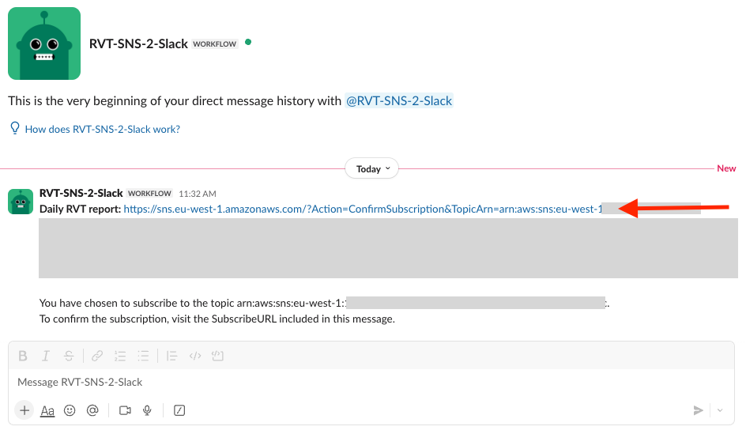

# Slack Integration for RVT Notifications

This guide shows how to configure Slack to receive daily RVT validation reports via SNS webhooks.

## Prerequisites
- Slack workspace with admin permissions

## Step 1: Create Slack Workflow

1. In Slack, click the three dots menu and select **Automations**
2. Click **+ New Workflow**

3. In the workflow builder:
   - Click **Untitled Workflow** 
   - Enter a name eg. `RVT-SNS-2-Slack`
   - Add description: `Workflow to receive daily notifications in Slack`
   - Click **Save**

## Step 2: Configure Webhook Trigger

1. Click **Choose an event**
2. Select **From a Webhook**

## Step 3: Setup Variables

1. Click **Setup variables**

2. Create these 3 variables:

> ⚠️ **IMPORTANT**: Variable names are **case-sensitive** and must be typed exactly as shown below. Any deviation in capitalization will cause the integration to fail.

**Variable 1: SubscribeURL**
- Type: Text
- Purpose: Contains SNS subscription confirmation link (first-time only)

**Variable 2: Subject**
- Type: Text  
- Purpose: Contains report subject with project name and date

**Variable 3: Message**
- Type: Text
- Purpose: Contains report body with statistics and S3 location

3. Click **Continue**

## Step 4: Configure Message Action

1. Click **Add steps**

2. Under Messages, choose your preferred option (this demo uses **Send a message to a person**):
   - **Send a message to a person** (direct message)
   - **Send a message to a channel** (channel notification)

3. Configure the message:
   - Select recipient (person or channel)
   - In **Add a message**, create your template:
4. Use **Insert a variable** to add the variables created earlier
5. Click **Save**

## Step 5: Get Webhook URL

1. Click **Starts with a webhook**
2. Scroll down and copy the **Request URL**
3. **Important**: Keep this URL secure - anyone with access can trigger your workflow

## Step 6: Publish Workflow

1. Click **Finish Up** (top right)
2. Configure access permissions (restrict to appropriate team members)
3. Click **Publish**

## Step 7: Configure RVT with Slack Webhook

1. Use the copied webhook URL in your RVT CloudFormation template
2. Enter the URL in the `SlackWebhookURL` parameter
3. Deploy the template

## Step 8: Confirm Subscription

After deployment, you'll receive an initial message with a subscription confirmation link:

1. Click the subscription URL to confirm
2. Once confirmed, you'll start receiving daily RVT reports:

## Troubleshooting

- **No messages received**: Verify webhook URL is correctly configured in RVT template
- **Subscription not working**: Check that you clicked the confirmation link
- **Formatting issues**: Ensure variables are case-sensitive and properly inserted

## Security Considerations

- Keep webhook URLs confidential
- Limit workflow access to authorized personnel only
- Regularly review and rotate webhook URLs if compromised